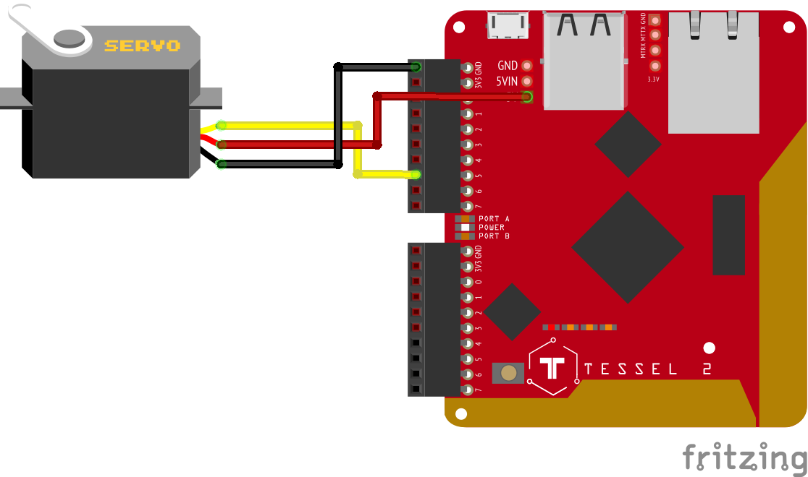

# t2-vue-test

A simple application that shows how to:

* Serve a Vue application off of a Tessel 2
* Connect to it over http to send commands
* Run a servo off a Tessel 2 without the servo board

This is associated with a [quick walkthrough](https://gist.github.com/jherr/980ef1a240223f9b859f3e70161cf120) on setting up Vue for the Tessel 2.

## Wiring



## Project setup
```
yarn install
```

### Local development
```
yarn serve
```

### Release build and upload to Tessel 2
```
yarn tessel:run
```
